# Projet_P7
## Résolvez des problèmes en utilisant des algorithmes en Python

### 1) Description de l'application

Ce projet consiste à développer un programme qui permet de choisir pour un client la combinaison d'actions parmi N actions lui permettant de réaliser le meilleur profit pour un investissement maximal (W).

Le programme doit respecter les contraintes suivantes :

- Chaque action est caractérisée par les attributs :
    - name
    - price (equivalent du poids : w)
    - profit (équivalent de la valeur: v)

- Chaque action ne peut être achetée qu'une seule fois.
- Le client ne peut pas acheter une fraction d'action.
- Le client peut investir 500 euros maximum.

#### 1.1) Organisation du projet

2 dossiers :

- `data` pour stocker les fichiers csv à exploiter.
- `results` pour stocker les fichiers de résultats au format txt.

3 scripts en Python :

- `bruteforce.py` : algorithme de force brute
- `optimized.py` : algorithme optimisé
- `back_test_cvxpy.py` : programme de test utilisant la bibliothèque de résolution et d'optimisation de problèmes `cvxpy`

#### 1.2) GitFlow du projet

Le projet est organisé en 2 branches :

* Branche de développement : `p7_dev`
* Branche principale (version stable du projet) : `main`

### 2) Installation du projet Projet_P7 sur votre machine

Sur votre poste de travail, créer un dossier dans lequel vous allez installer le projet.

On nommera par exemple ce dossier `projects`. (vous pouvez le nommer autrement, c'est juste pour avoir une référence dans la suite des explications)

Aller sur le dépôt github : https://github.com/yannis971/Projet_P7

Pour l'installation, il y a 2 méthodes possibles.

#### 2.1) Première méthode : Téléchargement du fichier zip

Dans l'onglet **<> Code** de la page ci-dessus, cliquer sur le bouton **Code** puis sur **Download ZIP**

Placer le fichier zip dans le dossier `projects` et le dézipper.

Ouvrir un terminal et se déplacer dans la racine du projet dossier `projects/Projet_P7-main/`

Passer à l'étape 3 pour configurer l'environnement virtuel

#### 2.2) Deuxième méthode : Clonage du dépôt avec git

Sur la figure précédente, copier le lien https : https://github.com/yannis971/Projet_P7.git

Ouvrir un terminal et se déplacer dans le dossier `projects` créé précédemment et taper la commande :

`git clone` suivi du lien https copié plus haut.

soit : `git clone https://github.com/yannis971/Projet_P7.git`

Se déplacer dans la racine du projet : dossier `projects/Projet_P7`

Passer à l'étape 3 pour configurer l'environnement virtuel

### 3) Configuration de l'environnement virtuel

#### Remarque

Les commandes ci-dessous (notamment celles concernant l'installation de pip pour python3) sont valables sur un système d'exploitation Linux de type Debian ou de ses dérivés.

Pour Windows, on utilise python et pip.

Pour Mac OS, on utilise python3 et pip3.

#### 3.1) Installer pip pour python3 si ce n'est pas déjà fait

Si la commande `pip3 --version` renvoie une erreur alors il convient d'installer pip

`sudo apt-get update && sudo apt-get install python3-pip`

Si l'installation a réussi, la commande vous renverra une ligne comme indiqué ci-dessous

`pip 20.2.3 from /soft_desk/yannis/.local/lib/python3.8/site-packages/pip (python 3.8)`

#### 3.2) Créer un environnement virtuel et l'activer

Se placer à la racine du projet (dossier `projects/Projet_P7`) et lancer la commande :

`python3 -m venv env`

Une fois l'environnement virtuel  `env` créé, l'activer avec la commande :

`source env/bin/activate`

#### 3.3) Installer les dépendances du projet

Toujours à la racine du projet, lancer l'une des 2 commandes suivantes :

`pip3 install -r requirements.txt`

`python3 -m pip install -r requirements.txt`

### 4) Exécution

#### 4.1) Algorithme de force brut

Une fois l'environnement virtuel activé et les dépendances du projet Projet_P7 installées, en étant positionné dans le dossier `projects/Projet_P7`, exécuter la commande :

`python3 bruteforce.py`

Le programme lit le fichier `data/bruteforce.csv`, génère le fichier résultats `results/results_bruteforce.txt` et écrit dans la console le nombre de combinaisons calculées et les statistiques liées à l'exécution du programme (temps elpase, temps cpu, perf_counter).

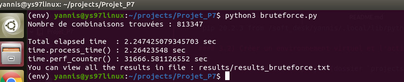

#### 4.2) Algorithme optimisé

La commande `python3 optimized.py` affiche l'aide du programme `optimized.py`.

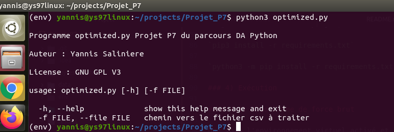

Le programme attend en paramètre le chemin vers le fichier csv à traiter.

**Run avec le fichier data/dataset1_P7.csv**

Dans le répertoire `Projet_P7`, taper la commande :

`python3 optimized.py -f data/dataset1_P7.csv`

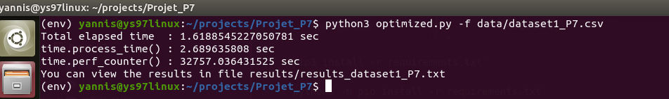

**Run avec le fichier data/dataset1_P7.csv**

Dans le répertoire `Projet_P7`, taper la commande :

`python3 optimized.py -f data/dataset2_P7.csv`

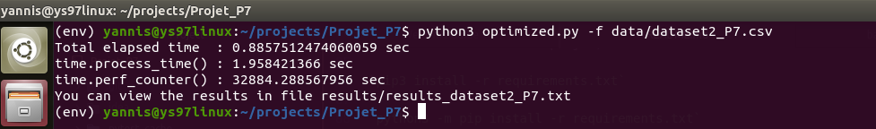

**Run avec le fichier data/bruteforce.csv**

Dans le répertoire `Projet_P7`, taper la commande :

`python3 optimized.py -f data/bruteforce.csv`

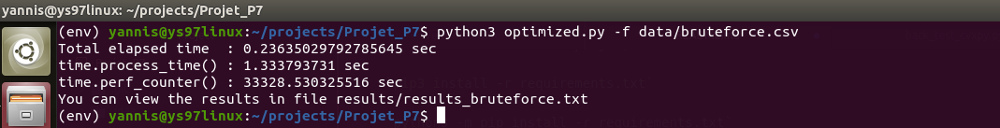

Ce dernier run permet de constater que pour le même fichier bruteforce.csv on passe d'un temps elapsed de :
- 2,217 secondes avec l'algorithme de force brut à
- 0,236 secondes avec l'algorithme optimisé

##### 4.3) Test avec le pacakge `cvxpy`

Le programme `back_test_cvxpy.py` est une copie du programme `optimized.py` dans lequel le problème posé est résolu grace à la bibliothèque `cvxpy`.

Pour plus d'informations sur cette bibliothèque, aller sur le site : https://www.cvxpy.org/tutorial/intro/index.html

**Run avec le fichier data/dataset1_P7.csv**

Dans le répertoire `Projet_P7`, taper la commande :

`python3 back_test_cvxpy.py -f data/dataset1_P7.csv`

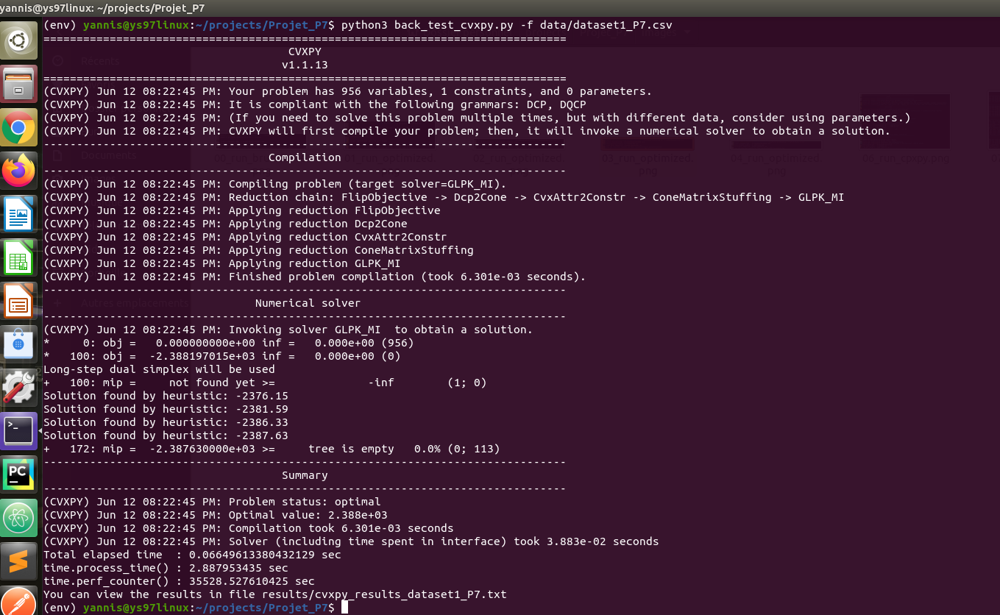

**Run avec le fichier data/dataset1_P7.csv**

Dans le répertoire `Projet_P7`, taper la commande :

`python3 back_test_cvxpy.py -f data/dataset2_P7.csv`

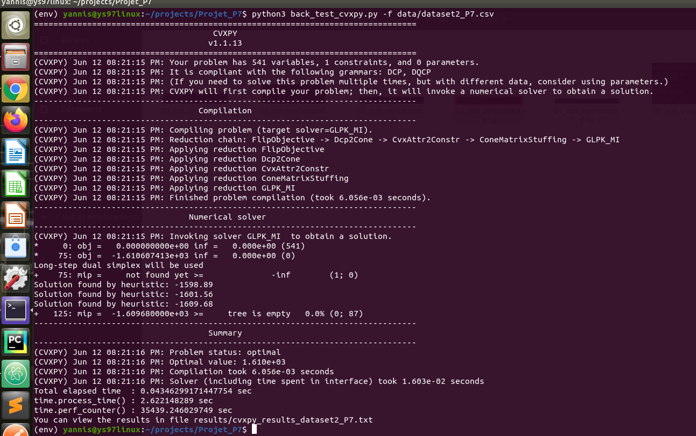

**Run avec le fichier data/bruteforce.csv**

Dans le répertoire `Projet_P7`, taper la commande :

`python3 back_test_cvxpy.py -f data/bruteforce.csv`

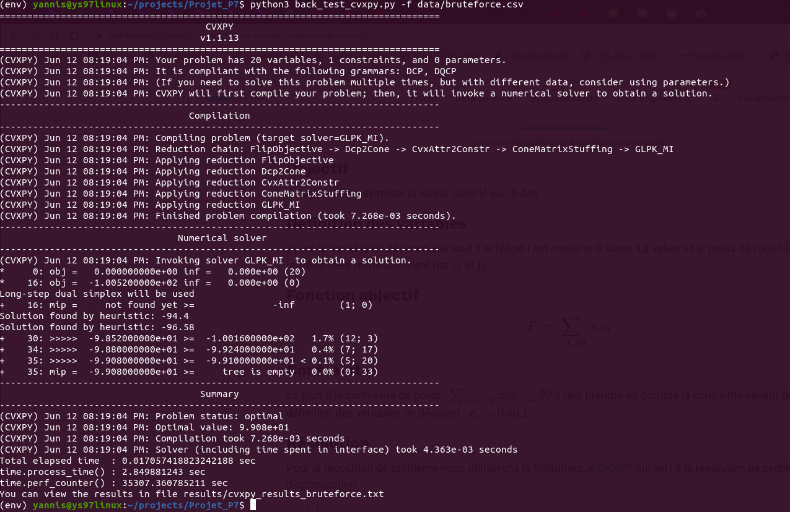

##### 4.4) Comparaison des fichiers résultats

Il s'agit de vérifier que les résultats obtenus avec les alogrithmes proposés sont identiques à ceux obtenus avec la bibliothèque `cvxpy`.

Pour cela, on peut utiliser la commande Unix `diff`.

**Comparaison des résultats sur le fichier bruteforce.csv**

Dans le répertoire `Projet_P7`, taper la commande :

`diff -s results/cvxpy_results_bruteforce.txt results/results_bruteforce.txt`

L'option `-s` permet de tester si les 2 fichiers sont identiques

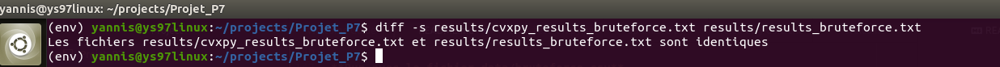

Résultat conforme : le contenu des fichiers comparés est identique

**Comparaison des résultats sur le fichier dataset1_P7.csv**

Dans le répertoire `Projet_P7`, taper la commande :

`diff -s results/cvxpy_results_dataset1_P7.txt results/results_dataset1_P7.txt`

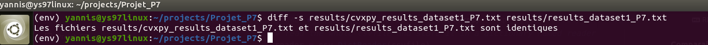

Résultat conforme : le contenu des fichiers comparés est identique

**Comparaison des résultats sur le fichier dataset1_P7.csv**

Dans le répertoire `Projet_P7`, taper la commande :

`diff -s results/cvxpy_results_dataset2_P7.txt results/results_dataset2_P7.txt`

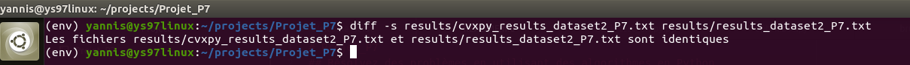

Résultat conforme : le contenu des fichiers comparés est identique

### 5) Licence

Le code de ce projet est sous licence libre **GNU GPL V3**

### 6) Questions/Aide/Support

En cas de problème ou pour toute question relative à ce projet, vous pouvez me contacter via l'un des canaux suivants :

* e-mail : yannis.saliniere@gmail.com

* twitter : https://twitter.com/YSaliniere

* rubrique "issues" du projet github : https://github.com/yannis971/Projet_P7/issues
